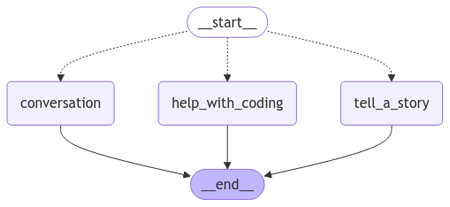

# LangGraph MultiAgent Network Demo

This is an example of how you can use LangGraph to create a network of LLMs.

## Installation

- Download Ollama - https://ollama.com/blog/llama3
- Run the LLMs you wish to using Ollama.
    - For all the models I use:
        - Run ./modelfiles/run.bat for Windows users.
        - Run the individual modelfiles using Ollama.
- Use the package manager [pip](https://pip.pypa.io/en/stable/) to install any dependencies using the requirements.txt
  file (pip install -r requirements.txt)

## Use

- Run main.py, which will give you a CLI to talk to this network.

## Network Mermaid Diagram

## How does this work?

- Learning about Edges is important for this - [Check it out here](https://langchain-ai.github.io/langgraph/concepts/low_level/#edges)
- Look at main.py and read the code as you follow along.

There are 5 nodes:

- The Start node - "supervisor_routing"
    - The Supervisor which uses Llama3.2 (see the supervisor_routing function)
    - Determines whether the prompt given is about coding, storytelling, or
      conversation (default)
- The Conversation node - "conversation"
  - Uses Llama3.2 wrapped in a react agent to respond
  - Has a simple tool to roll dice that it can use
- The Coding node - "help_with_coding"
  - Uses CodeLlama to respond to the prompt
  - CodeLlama has been instructed to help with the coding prompt
- The Story node - "tell_a_story"
  - Uses Mistral to respond to the prompt
  - Mistral has been instructed to tell a story based on the prompt
- The End node - Just ends.

Coding example flow:
- The user asks "How do I print the numbers 1 to 10 in Python?"
- The prompt goes to the Start node
  - Is a conditional edge, meaning that it will respond with the name of another node to send the prompt to.
  - In this case, the supervisor returns "help_with_coding"
- The prompt then goes to the Coding node
  - The prompt is processed by the llm in the node and returns the result
- This then moves to the End node, ending the graph.
- The user gets their response.

Conversation example flow:
- The user asks "How are you doing today?"
- The prompt goes to the Start node
  - Is a conditional edge, meaning that it will respond with the name of another node to send the prompt to.
  - In this case, the supervisor returns "conversation" as the prompt does not seem to be about storytelling or coding.
- The prompt then goes to the Conversation node
  - The prompt is processed by the llm in the node and returns the result
- This then moves to the End node, ending the graph.
- The user gets their response.